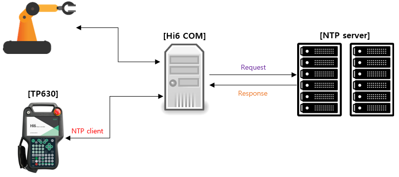

# 1.1 What is NTP time synchronization?

NTP(Network Time Protocol) is a protocol used to synchronize time across all devices in the network. By default, UDP port 123 is used.

 </img>
 <em>
Figure 1.1 NTP time synchronization on Hi6 robot controller
</em>

---

The definition of NTP can be found in RFC 5905: Network Time Protocol Version 4: Protocol and Algorithm Specification.

