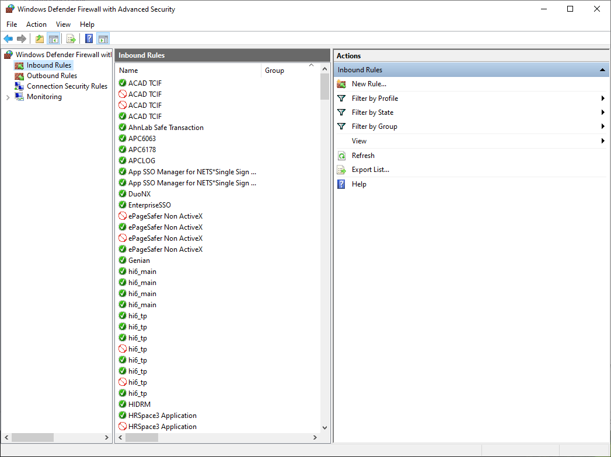
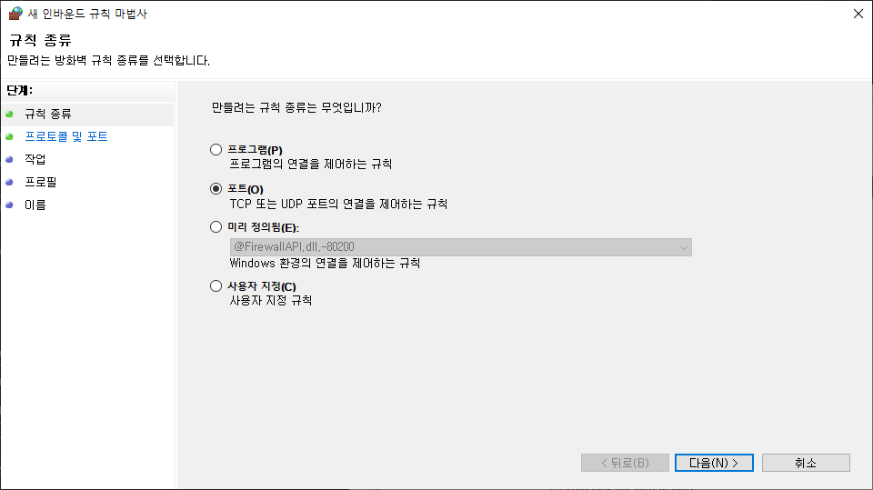
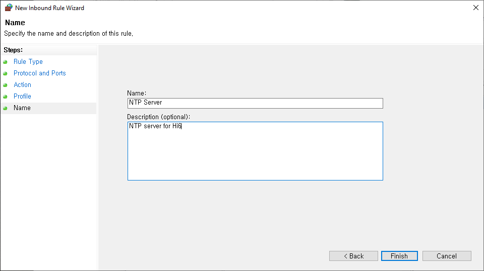

# 2.1 Set Windows PC as an NTP server

To use a Windows PC as an NTP server, you must follow the steps below.

1. Enable NTP server feature in Windows.
    * Use w32time(Windows Time Service)
    1. Open 'Registry Editor'
    2. Go to the path 'HKEY_LOCAL_MACHINE\SYSTEM\CurrentControlSet\Services\W32Time\Config'
        * Set the value of the 'AnnounceFlags' entry to 5(NTP server) - default may be 10
        <p align="center">
         </img>
         <em><p align="center">Figure 2.1 NTP Server Setting(Registry Editor)</p></em>
        </p>
    3. Go to the path 'HKEY_LOCAL_MACHINE\SYSTEM\CurrentControlSet\Services\W32Time\TimeProviders\NtpServer'
        * Set the value of 'Enabled' entry to 1(enabled)
        <p align="center">
         </img>
         <em><p align="center">Figure 2.2 NTP Server Setting(Registry Editor)</p></em>
        </p>
2. Restart the Windows Time service
    * In 'Command Prompt', enter the following command with administrator privileges.
    ```
        net stop w32time
        net start w32time
    ```
3. Windows Firewall setting
    * NTP uses UDP port 123 by default. Therefore, the port must be open to act as an NTP server
    1. Open 'Control Panel'
    2. Select 'Windows Defender Firewall'
    3. Select 'Advanced Settings'
    4. Select 'Inbound Rules' in 'Windows Defender Firewall with Advanced Security on Local Computers'
        <p align="center">
         </img>
         <em><p align="center">Figure 2.3 NTP Server Settings(Firewall)</p></em>
        </p>
    5. Select 'New Rule...'
        * The 'New Inbound Rule Wizard' window opens
        1. Rule Type: Port(O)
            <p align="center">
             </img>
             <em><p align="center">Figure 2.4 NTP Server Settings(Firewall)</p></em>
            </p>
        2. Protocol and Port
            * UDP(U)
            * Specific local port(S): 123
            <p align="center">
             </img>
             <em><p align="center">Figure 2.5 NTP Server Settings(Firewall)</p></em>
            </p>
        3. Task: Allow connection(A)
            <p align="center">
             </img>
             <em><p align="center">Figure 2.6 NTP Server Settings(Firewall)</p></em>
            </p>
        4. Profile: Domain(D), Personal(P), Public(U)
            <p align="center">
             </img>
             <em><p align="center">Figure 2.7 NTP Server Settings(Firewall)</p></em>
            </p>
        5. Name: Write a name(N) and description(optional)(D)
            <p align="center">
             </img>
             <em><p align="center">Figure 2.8 NTP Server Settings(Firewall)</p></em>
            </p>

