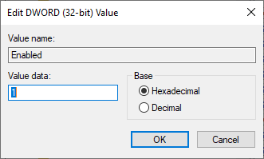
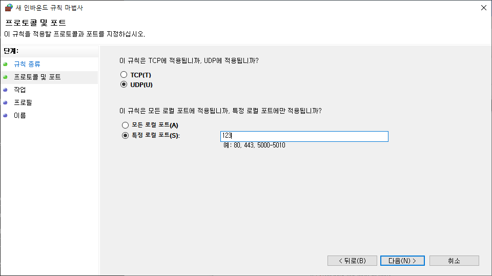
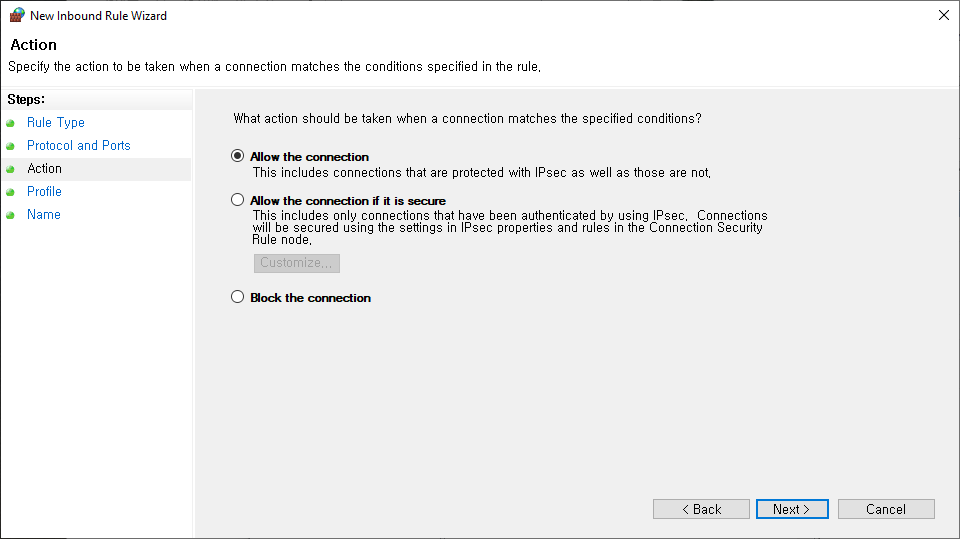
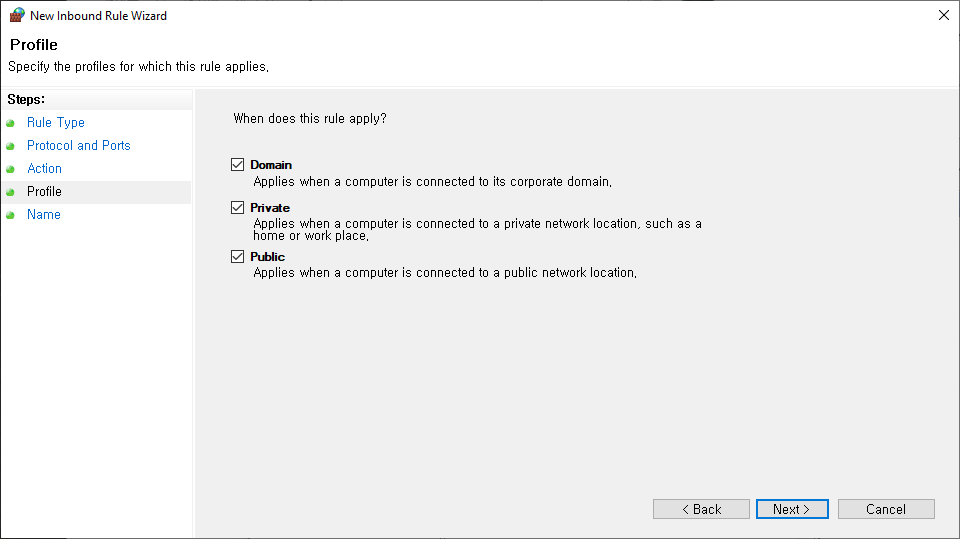

# 2.1 윈도우 PC를 NTP 서버로 설정

윈도우(Windows 10) PC를 NTP 서버로 사용하기 위해서는 아래의 단계를 수행해야 합니다.

1. Windows에서 NTP 서버 기능 활성화
    * w32time(Windows Time Service) 사용
    1. '레지스트리 편집기' 열기
    2. 'HKEY_LOCAL_MACHINE\SYSTEM\CurrentControlSet\Services\W32Time\Config' 경로로 이동
        * 'AnnounceFlags' 항목의 값을 5(NTP 서버)로 설정 - 기본값은 10일 수 있음
        <p align="center">
         </img>
         <em><p align="center">그림 2.1 NTP 서버 설정(레지스트리 편집기)</p></em>
        </p>
    3. 'HKEY_LOCAL_MACHINE\SYSTEM\CurrentControlSet\Services\W32Time\TimeProviders\NtpServer' 경로로 이동
        * 'Enabled' 항목의 값을 1(활성화)로 설정
        <p align="center">
         </img>
         <em><p align="center">그림 2.2 NTP 서버 설정(레지스트리 편집기)</p></em>
        </p>
2. Windows Time 서비스 재시작
    * '명령 프롬프트'에서 관리자 권한으로 다음 명령을 입력
    ```
        net stop w32time
        net start w32time
    ```
3. Windows 방화벽 설정
    * NTP는 기본적으로 UDP 123번 포트를 사용. 따라서 NTP 서버 역할을 하려면 해당 포트가 열려 있어야 함
    1. '제어판' 열기
    2. 'Windows Defender 방화벽' 선택
    3. '고급 설정' 선택
    4. '로컬 컴퓨터의 고급 보안이 포함된 Windows Defender 방화벽'의 '인바운드 규칙' 선택
        <p align="center">
         </img>
         <em><p align="center">그림 2.3 NTP 서버 설정(방화벽)</p></em>
        </p>
    5. '새 규칙...' 선택
        * '새 인바운드 규칙 마법사' 창이 열림
        1. 규칙 종류: 포트(O)
            <p align="center">
             </img>
             <em><p align="center">그림 2.4 NTP 서버 설정(방화벽)</p></em>
            </p>
        2. 프로토콜 및 포트
            * UDP(U)
            * 특정 로컬 포트(S): 123
            <p align="center">
             </img>
             <em><p align="center">그림 2.5 NTP 서버 설정(방화벽)</p></em>
            </p>
        3. 작업: 연결 허용(A)
            <p align="center">
             </img>
             <em><p align="center">그림 2.6 NTP 서버 설정(방화벽)</p></em>
            </p>
        4. 프로필: 도메인(D), 개인(P), 공용(U)
            <p align="center">
             </img>
             <em><p align="center">그림 2.7 NTP 서버 설정(방화벽)</p></em>
            </p>
        5. 이름: 이름(N)과 설명(옵션)(D) 작성
            <p align="center">
             </img>
             <em><p align="center">그림 2.8 NTP 서버 설정(방화벽)</p></em>
            </p>
        6. 마침(F)

