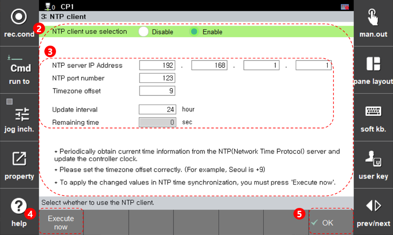

# 3.1 설정

1. \[시스템 &gt; 2: 제어 파라미터 &gt; 9: 네트워크 &gt; 2: 서비스 &gt; 3: NTP 클라이언트\] 메뉴를 터치하십시오.

2. NTP 시간 동기화에 필요한 각 파라미터를 설정합니다.

3. '지금 실행' 버튼을 터치해 NTP 시간 동기화를 수행할 수 있습니다.

* NTP 클라이언트 사용 여부 : '무효'

 </img>
 <em>
그림 3.1 NTP 클라이언트 화면(무효)
</em>

* NTP 클라이언트 사용 여부 : '유효'

 </img>
 <em>
그림 3.2 NTP 클라이언트 화면(유효)
</em>

<table>
 <thead>
  <tr>
   <th style="text-align:left">번호</th>
   <th stype="text-align:left">설명</th>
  </tr>
 </thead>
 <tbody>
  <tr>
   <td style="text-align:left">
    
   </td>
   <td style="text-align:left">
    NTP 클라이언트 사용 여부로 '무효'를 선택했을 때 화면입니다.
   </td>
  </tr>
  <tr>
   <td style="text-align:left">
    
   </td>
   <td style="text-align:left">
    NTP 클라이언트 사용 여부로 '유효'를 선택했을 때 화면입니다.
   </td>
  </tr>
  <tr>
   <td style="text-align:left">
    
   </td>
   <td style="text-align:left">
    NTP 시간 동기화를 위한 값을 설정합니다.
     <li><b>NTP 서버 주소 : </b>NTP 서버의 IP 주소(IPv4)를 입력하십시오.</li>
     <li><b>NTP 포트 번호 : </b>NTP에서 사용할 포트 번호를 입력하십시오. NTP는 표준 포트로 123번 포트를 사용합니다.</li>
     <li><b>타임존 오프셋 : </b>현재 지역의 타임존 오프셋을 입력하십시오.</li>
     <li><b>갱신 간격 : </b>주기적인 시간 동기화를 위한 갱신 간격을 시(hour) 단위로 입력하십시오.</li>
     <li><b>남은 시간 : </b>다음 시간 동기화까지 남은 시간을 초(sec) 단위로 보여줍니다.</li>
   </td>
  </tr>
  <tr>
   <td style="text-align:left">
    
   </td>
   <td style="text-align:left">
    NTP 시간 동기화를 수행합니다.
   </td>
  </tr>
  <tr>
   <td style="text-align:left">
    
   </td>
   <td style="text-align:left">
    설정을 저장합니다. NTP 시간 동기화에 변경된 설정값을 적용하기 위해서는 '지금 실행' 버튼을 터치하십시오.
   </td>
  </tr>
 </tbody>
</table>

