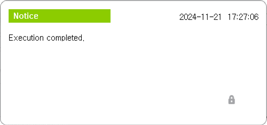
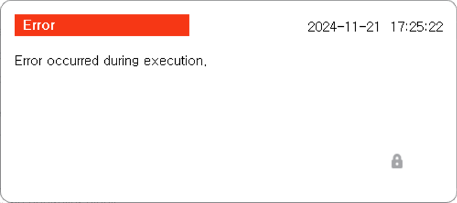

# 3.2 실행

'주기적 갱신' 또는'지금 실행' 버튼을 터치해 NTP 시간 동기화를 수행합니다.

NTP 시간 동기화 수행 결과에 따라 아래 그림과 같은 메시지 박스가 나타납니다.

 </img>
 <em>
그림 3.3 NTP 시간 동기화 수행 결과(성공)
</em>

NTP 시간 동기화가 성공적으로 수행되었습니다.

 </img>
 <em>
그림 3.3 NTP 시간 동기화 수행 결과(실패)
</em>

NTP 시간 동기화에 실패하였습니다.


* NTP 서버의 IP 주소(IPv4)를 정확하게 입력했는지 확인하십시오.
* NTP 포트 번호로 다른 곳에서 사용 중인 포트 번호를 입력하지 않도록 주의하십시오. NTP 표준 포트인 123번을 사용하는 것을 권장합니다.
* 주기적인 시간 동기화를 수행하고 싶지 않은 경우, '갱신 간격'으로 0을 입력하십시오.


