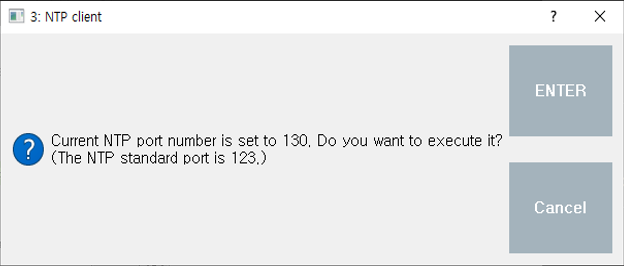

# 3.2 Execute now

Touch the 'Execute now' button to perform NTP time synchronization.

If you use a port number other than 123 as the NTP port number, a message box as shown below will appear. Touch 'Enter' to perform NTP time synchronization to that port, otherwise touch 'Cancel'.

 </img>
 <em>
Figure 3.3 Use a value other than 123 as the NTP port number
</em>

Depending on the results of executing NTP time synchronization, a message box as shown below will appear.

 </img>
 <em>
Figure 3.4 Results of NTP Time Synchronization(Success)
</em>

NTP time synchronization was performed successfully.

 </img>
 <em>
Figure 3.5 Results of NTP Time Synchronization(Fail)
</em>

NTP time synchronization failed.


* Be careful not to enter a port number that is in use elsewhere as the NTP port number. We recommend using NTP standard port 123.


